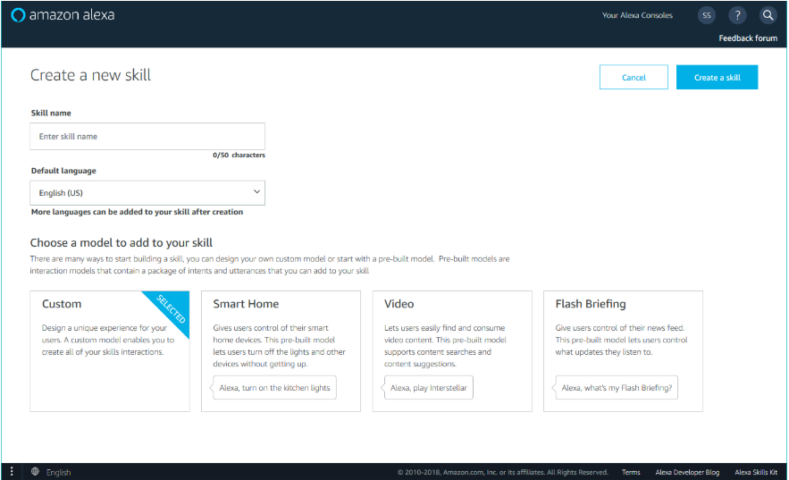
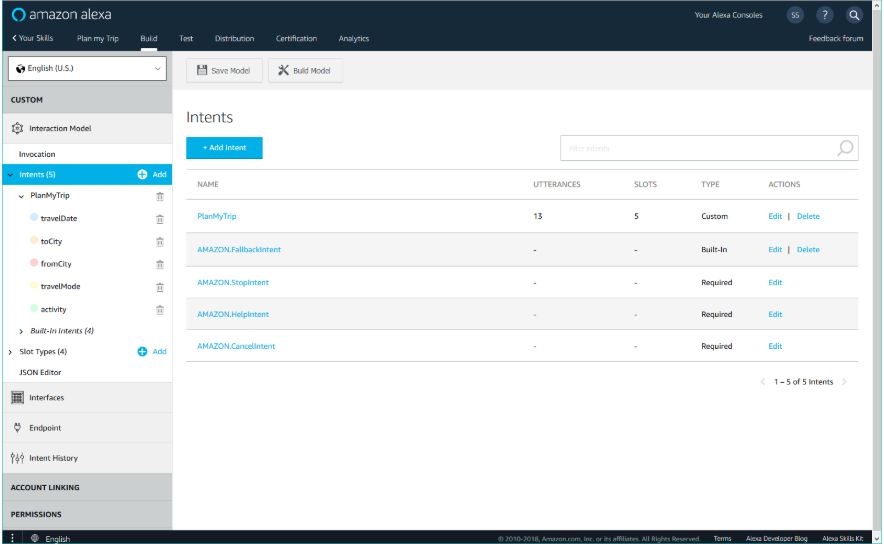
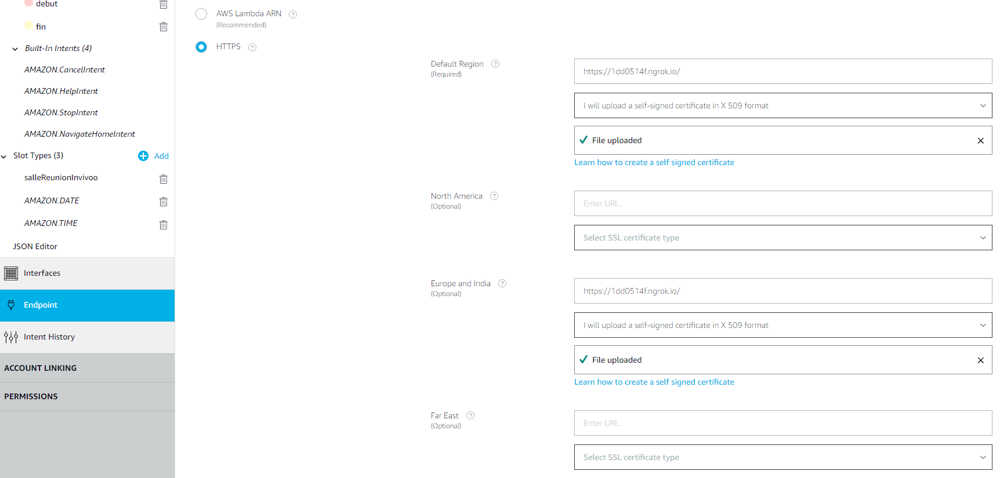
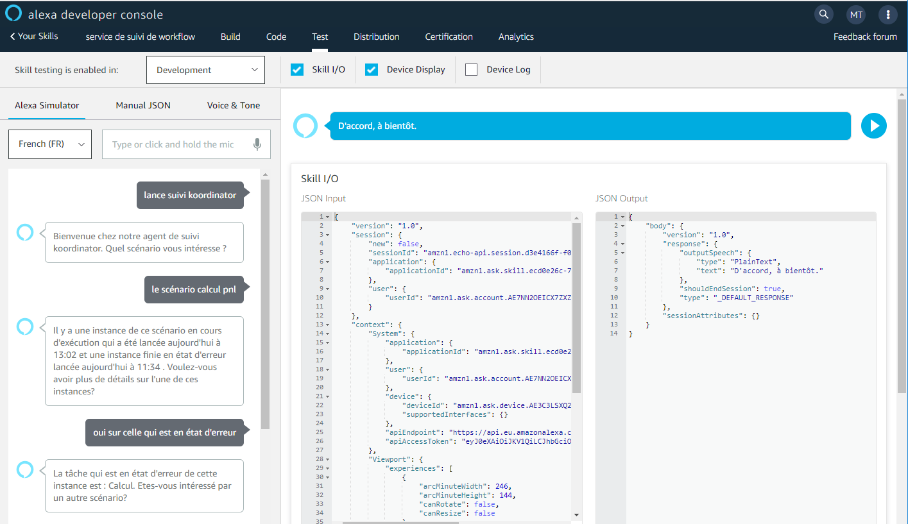

# Voice Control Koordinator 

This module creates 3 skills connected to Alexa and XComponent Koordinator. XComponent Koordinator is a web 
plateform which enables iterative creation of scenarios by business lines, ensures access to data and allows business
lines to produce their result without turning to it personnel. 
For more information about our XComponent plateform, you can see [link](https://www.xcomponent.com/en/)

The implemented skills in this module allow user to interact with our Koordinator plateform by voice command. These skills are:
- Koordinator: start workflow
- Suivi Koordinator: follow workflow progress
- Notification Koordinator: ask for manual task notifications and control them by validating or cancelling tasks

XComponent Koordinator 

## Development

### Requirements 

- Create [Amazon Developer Account](https://developer.amazon.com/)
- Python 3.6
- Pipenv
- pip version = 9.0.3
- Download the [ngrok](https://ngrok.com/download/) client for your operating system:
    - The skill must run behind a public HTTPS server or AWS Lambda function
    - ngrok is a command-line program that opens a secure tunnel to localhost and exposes that tunnel behind an HTTPS endpoint.
    - To launch ngrok, run this command-line:
    ````
    ngrok.exe http 5000
    ```` 
- If you are hosting locally the skill, you should create a self-signed SSL certificate for your HTTPS endpoint.
 
### Creating SSL certificate

- To create SSL certificate, you should access to configuration file in the directory `alexaskill\scripts\conig` and replace the following content with your own values:
```
ST: Provide your two letter state abbreviation
L: Provide the name of the city in which you are located
O: Provide a name for your organization
CN: Provide the name of your skill as it is named in the developer console
DNS.1: Provide the fully qualified domain name for your endpoint
```
If you use ngrok without fix subdomain, you have to update the DNS.1 field every time you restart ngrok with the subdomain generated (subdomain sample generated with ngrok: `1dd0514f.ngrok.io`).
For more details on creating the SSL certificate, see this [link](https://developer.amazon.com/docs/custom-skills/configure-web-service-self-signed-certificate.html#h3_update_selfsigned/).   

- After filling the configuration file content, access to `alexaskill` directory and run the script `create_ssl_certficate.py`:
```
cd alexaskill
python scripts\create_ssl_certficate.py
cd ..
```
This command-line creates the SSL certificate file `certificate.pem` in the directory `data\ssl`. You should upload this certificate to the developer console when you set up the skill, and configure your endpoint to present this certificate when it connects to Alexa.

### Building and testing from sources

Install [pipenv](https://docs.pipenv.org/) (the officially recommended packaging tool for Python):

```
pip install pipenv
```

Install the version 9.0.3 of `pip`

```
pipenv run pip install pip==9.0.3
```

Install dependencies:

```
pipenv install
```

Run build and test script:

```
pipenv run .\build.bat
```

Launch *koordinator* skill:
```
pipenv run python __main_workflow_launch__.py
```

Launch *suivi koordinator* skill:
```
pipenv run python __main_workflow_status__.py
```

Launch *notification koordinator* skill:
```
pipenv run python __main_task_notification__.py
```

## Running unit tests

Use the *nose* runner to run unit tests.

```
pipenv run nosetests tests/alexaskill alexaskill --exe
```

## Creation skill steps in the Amazon developer console

1. [Create new skill and choose the language and the interaction model to add to your skill (Custom, Smart home, ...)](https://developer.amazon.com/docs/devconsole/create-a-skill-and-choose-the-interaction-model.html)

2. [Create the intents used in your skill and put sample utterances for each intent](https://developer.amazon.com/docs/custom-skills/create-intents-utterances-and-slots.html). You can use Amazon intents (Built-in intents)

3. Configure the endpoint in AWS mode or HTTP mode if you are hosting and building locally your skill. For the second mode, you have to choose `self-signed certificate in X 509 format` and you upload your SSL certificate (created with `create_ssl_certficate.py` script) to the developer console

4. Save your model and build the skill
5. If the build is successfully performed, [you can test your skill by text or voice by using Alexa Simulator](https://developer.amazon.com/docs/devconsole/test-your-skill.html)

